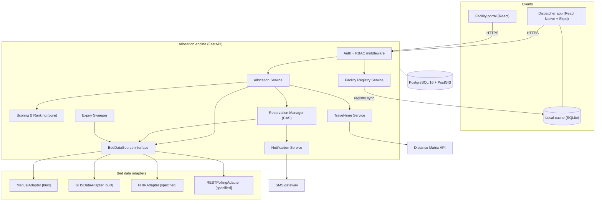
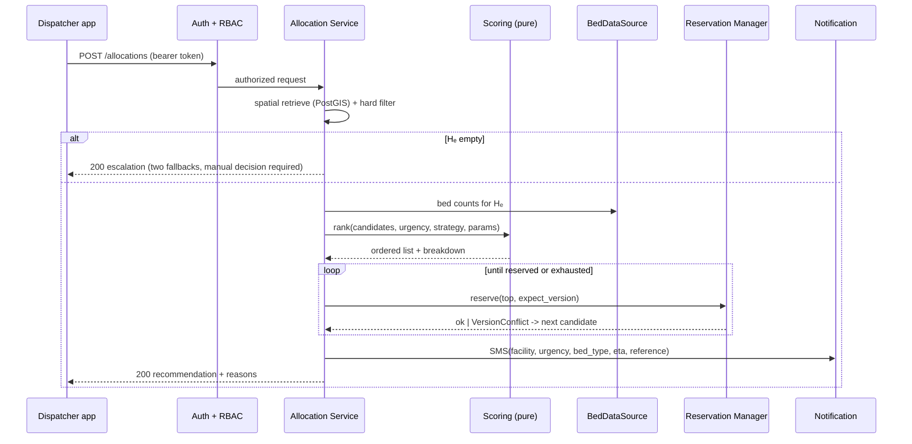

# 01 — Architecture

> Source of truth: thesis §3.5.5, §3.6. Constants in [09-parameters.md](./09-parameters.md).

## 1. Principle

All scoring and ranking logic lives in **one place**: the server-side allocation engine. Clients render; they never compute. This guarantees that the behaviour observed in scenario testing is the behaviour in live operation, and avoids a second implementation on the device that would drift. It is also why the offline mobile mode is *informational only* (thesis §3.6.4).

A second principle governs the interior: **scoring is pure, reservation is stateful.** Steps 1–7 of the pipeline perform no mutation and read no clock; only the reservation touches shared state. Keeping them apart is what makes the contribution unit-testable and what allows a lost race to be recovered by falling through a pre-computed ranking.

## 2. Layers (thesis Figure 3.5)

| Layer | Responsibility |
|---|---|
| **Presentation** | Dispatcher mobile app; facility administration web portal; offline informational mode |
| **Security** | Authentication, role-based authorization, session management, audit logging |
| **API** | REST endpoints for requests, allocations, bed updates, registration, user management |
| **Allocation** | Hard filter, normalisation, scoring and ranking strategies, candidate selection |
| **Coordination** | Compare-and-set reservation, ETA tracking, expiry sweeper, SMS dispatch |
| **Data access** | Vendor-agnostic `BedDataSource` adapter interface |
| **Persistence** | PostgreSQL 16 + PostGIS: facilities, bed state, users, roles, allocations, notifications, audit |

## 3. Components



## 4. Security layer (thesis §3.6.5)

Authentication by credential; JWT access + refresh tokens. Authorization is **centralised in middleware** — no endpoint performs its own permission check. This is what makes FR17 and FR18 testable as a role × endpoint matrix rather than by auditing every handler.

Permissions are **data**, seeded by migration ([02 §2.2](./02-data-model.md)), with a `scope` of `own_facility` or `all`. The middleware resolves scope against the authenticated account's `facility_id`.

**Separation of duties, enforced in both directions:**
- A dispatcher cannot write bed state — otherwise a dispatcher could manufacture the conditions for an allocation.
- A system administrator cannot write bed state — otherwise the party configuring the scoring parameters could also alter the data those parameters act on.

**Provisioning:** no self-service path grants privilege. Registration creates a `facility_request`; only approval creates an account.

## 5. Bed data adapter interface (thesis §3.6.2)

The engine calls **one** interface and is unaware of how bed data is sourced.

```python
class BedDataSource(Protocol):
    def name(self) -> str: ...
    async def fetch(self, facility_id: UUID) -> list[BedState]: ...
    async def reserve(self, facility_id: UUID, bed_type: BedType,
                      expect_version: int) -> None:
        """Raises VersionConflict if expect_version no longer matches."""
    async def release(self, facility_id: UUID, bed_type: BedType) -> None: ...
    async def health(self) -> HealthStatus: ...
```

| Implementation | Mechanism | Status |
|---|---|---|
| `ManualAdapter` | portal-entered bed counts held in `bed_state` | **built** (default) |
| `GHSDataAdapter` | reference adapter over Ghana Health Service facility data | **built** |
| `FHIRAdapter` | HL7 FHIR R4 EMR | specified |
| `RESTPollingAdapter` | configurable polling of any facility REST endpoint | specified |

**Two adapters ship, not one.** This is how NFR9 and S8 are *proved* rather than asserted: connecting a real EMR is visibly a third implementation of an existing interface, requiring no change to allocation logic.

## 6. Allocation service flow



## 7. Reservation and expiry (thesis §3.6.6, §3.7.6)

**Reads are advisory; the compare-and-set is authoritative.** A stale read costs a wasted attempt; it can never cause double allocation.

On `VersionConflict` the manager drops that facility and takes the **next candidate from the already-computed ranking** — no re-query, no re-score. Attempts are bounded by |Hₑ| since a candidate is dropped on each failure.

The **expiry sweeper** runs on a timer independent of any request, releasing reservations past `expires_at`, restoring availability and writing the audit entry. `expires_at = created_at + eta_minutes + RESERVATION_GRACE_MIN` — a *fixed* timeout is rejected because journeys in this network differ by an order of magnitude.

## 8. Travel-time service

Distance Matrix API with Haversine fallback at the configured urban speed factor, returning `is_estimated_travel_time = true` when the fallback is used. **Maps unavailability never produces an error response** — it produces a flagged recommendation.

## 9. Notification service

SMS to the receiving facility on reservation confirmation, carrying urgency, bed type, ETA and reservation reference. SMS rather than in-app notification because a facility cannot be assumed to hold an active session, to have installed anything, or to have reliable internet.

Acknowledgement is recorded but **advisory**: making departure conditional on it would let an unattended telephone delay a patient indefinitely, reintroducing at the destination the dependency on human availability that the system exists to remove.

## 10. Deployment

- **Engine + DB** containerised: `engine` (FastAPI/uvicorn) + `db` (postgres:16 with PostGIS) + `sweeper` (same image, different entrypoint).
- **Portal** built with Vite, served statically or by the engine.
- **Mobile** built with Expo, pointed at the engine base URL.
- Reproducible local Docker Compose is the deployment target; no cloud orchestration in scope.

## 11. Cross-cutting rules

- The engine **always** returns a recommendation or a structured escalation. Never a silent null, never a 5xx for maps unavailability.
- **No scoring logic in any client.** A thesis-level boundary; introducing it is a review-blocking violation.
- All researcher-defined constants read from `parameters.py` ([09](./09-parameters.md)).
- Every mutation is attributable to an authenticated account or a named adapter (NFR8).
