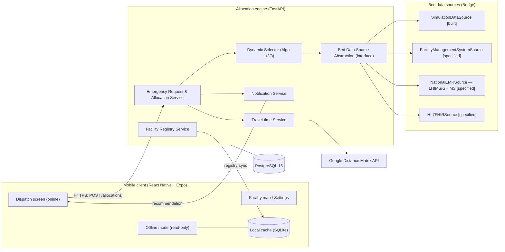
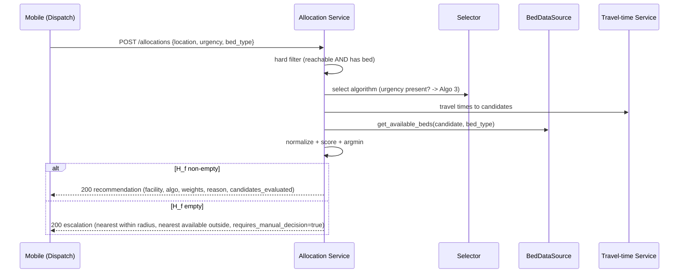

# 01 — Architecture

> Source of truth: thesis §3.3–3.6, §3.11. See [09-parameters.md](./09-parameters.md) for constants.

## 1. Principle

All matching logic lives in **one place**: the server-side allocation engine. The mobile app is a thin client. This guarantees that the matching behaviour observed in simulation is byte-for-byte the behaviour in live operation, and avoids a second implementation on the device. The offline mobile mode is therefore *informational only*.

## 2. Components



## 3. Service layers (thesis §3.4)

### 3.1 Facility Registry Service
Manages **static** facility attributes: name, coordinates (decimal lat/long), capability tier, supported bed types, contact telephone. Facilities are registered via the API; each registered facility joins the candidate pool. The mobile app syncs this registry into its local cache.

### 3.2 Bed Data Source Abstraction Layer (Bridge pattern — thesis §3.4.2)
The engine calls **one** abstract interface and is unaware of how bed data is sourced:

```
interface BedDataSource:
    get_available_beds(facility_id, bed_type) -> int
```

Four concrete implementations (status from thesis Table 3.1):

| Implementation | Mechanism | Status |
|----------------|-----------|--------|
| `SimulationDataSource` | reads/writes a `SimulationSession`'s bed state; decrements on allocation; never touches the live registry | **built** |
| `FacilityManagementSystemSource` | configurable polling adapter for any facility REST endpoint (URL, auth, field mapping via config) | specified |
| `NationalEMRSource` | adapter for Ghana's national EMR (LHIMS / GHIMS successor) | specified |
| `HL7FHIRSource` | connects to any HL7 FHIR R4 EMR | specified |

Moving from simulation to a live source = add an implementation + change config. **No change to matching logic.** This is the design property that makes the engine resilient to the LHIMS→GHIMS transition (thesis §3.11).

### 3.3 Emergency Request & Allocation Service
Per request: validate payload → determine whether it belongs to a simulation session → apply the hard filter → run the selected algorithm (via the Selector) → read bed availability through the `BedDataSource` → return a ranked recommendation **or** a structured escalation. Persists a full audit record (see [02-data-model.md](./02-data-model.md)).

### 3.4 Notification Service
Returns the recommendation in the API response and (online) via push notification. SMS via Africa's Talking is **stubbed** in the prototype (logs payload, does not transmit).

### 3.5 Dynamic Selector (thesis §3.6)
Chooses the algorithm at request time:

| Condition | Algorithm |
|-----------|-----------|
| valid urgency present (normal) | Algorithm 3 (urgency-adaptive) — **deployed default** |
| urgency missing/invalid | Algorithm 2 (fixed weights) — safe fallback |
| simulation baseline only | Algorithm 1 (greedy) — never deployed |

### 3.6 Travel-time Service
Google Distance Matrix API; Haversine fallback at 30 km/h with `is_estimated_travel_time=true` on API failure. In **simulation**, served from a precomputed distance matrix (thesis §3.12.1) — same interface, no live call per event.

## 4. Request data flow (live online dispatch)



## 5. Deployment topology (thesis Table 3.7)

- **Engine + DB** containerised with Docker Compose: `engine` (FastAPI/uvicorn) + `db` (PostgreSQL 16).
- **Mobile** built with Expo (managed workflow), pointed at the engine's base URL (configurable in Settings).
- Reproducible local environment is the deployment target for the prototype; no cloud orchestration is in scope.

## 6. Cross-cutting rules

- The engine **always returns a recommendation or a structured escalation** — it never fails silently on maps-API unavailability.
- The live facility registry is **never** modified by a simulation run; simulation bed state is isolated per `SimulationSession`.
- All researcher-defined constants are read from the parameters module; see [09-parameters.md](./09-parameters.md).
