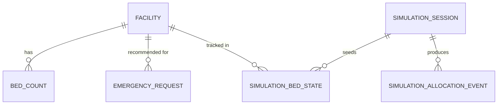

# 02 — Data Model

> Source of truth: thesis §3.7. Database: PostgreSQL 16, SQLAlchemy 2.x (async). **No PostGIS** — decimal lat/long only. Migrations via Alembic.

## 1. Entity-relationship overview

## 2. Entities

### 2.1 `facility` (static registry)
| Field | Type | Notes |
|-------|------|-------|
| id | UUID PK | |
| name | text | |
| latitude | numeric(9,6) | decimal degrees |
| longitude | numeric(9,6) | |
| tier | enum(tier) | tertiary / secondary / primary |
| supported_bed_types | enum(bedtype)[] | subset of {general, icu, maternity_specialist} |
| contact_phone | text | |
| active_data_source | enum | which `BedDataSource` feeds this facility (default `simulation`) |
| created_at / updated_at | timestamptz | |

### 2.2 `bed_count` (live availability, non-simulation)
| Field | Type | Notes |
|-------|------|-------|
| id | UUID PK | |
| facility_id | UUID FK→facility | |
| bed_type | enum(bedtype) | |
| available | int | ≥ 0 |
| capacity | int | total beds of this type |
| updated_at | timestamptz | |
| | | unique(facility_id, bed_type) |

### 2.3 `emergency_request` (audit of every allocation — thesis §3.4.3)
| Field | Type | Notes |
|-------|------|-------|
| id | UUID PK | |
| created_at | timestamptz | |
| patient_lat / patient_lon | numeric(9,6) | |
| urgency | enum(urgency) \| null | null/invalid ⇒ Algo 2 fallback |
| required_bed_type | enum(bedtype) | |
| simulation_session_id | UUID FK→simulation_session \| null | null ⇒ live request |
| algorithm_used | enum(algorithm) | greedy / weighted / urgency_adaptive |
| weight_vector | jsonb | the (w_t, w_b, w_c) actually applied |
| selection_reason | text | human-readable rationale |
| recommended_facility_id | UUID FK→facility \| null | null on escalation |
| travel_time_minutes | numeric | to recommended facility |
| is_estimated_travel_time | bool | true if Haversine fallback used |
| capability_match | numeric | ĉ of the placement |
| candidates_evaluated | int | size of search effort (feeds MCEE) |
| status | enum(status) | pending / allocated / escalated |

### 2.4 `simulation_session` (thesis §3.7, §3.12)
| Field | Type | Notes |
|-------|------|-------|
| id | UUID PK | |
| algorithm_config | enum(algorithm) | which algorithm this session runs |
| occupancy_scenario | numeric | 0.75 / 0.90 / 1.00 |
| weight_config | jsonb | weights in effect (for sensitivity runs) |
| radius_config | jsonb | radii in effect |
| capability_config | jsonb | capability matrix in effect |
| random_seed | bigint | recorded for reproducibility |
| events_planned | int | e.g. 100 |
| created_at | timestamptz | |

### 2.5 `simulation_bed_state` (per-session, isolated)
| Field | Type | Notes |
|-------|------|-------|
| id | UUID PK | |
| session_id | UUID FK→simulation_session | |
| facility_id | UUID FK→facility | |
| bed_type | enum(bedtype) | |
| available | int | seeded at target occupancy |
| capacity | int | |
| | | unique(session_id, facility_id, bed_type) |

### 2.6 `simulation_allocation_event` (per-event record)
| Field | Type | Notes |
|-------|------|-------|
| id | UUID PK | |
| session_id | UUID FK→simulation_session | |
| event_index | int | 0..events_planned-1 |
| virtual_arrival_min | numeric | on the virtual clock |
| urgency | enum(urgency) | |
| required_bed_type | enum(bedtype) | |
| patient_lat / patient_lon | numeric(9,6) | |
| recommended_facility_id | UUID \| null | |
| travel_time_minutes | numeric \| null | |
| time_to_bed_placement_min | numeric \| null | overhead + travel (ATBP contribution) |
| capability_match | numeric \| null | |
| candidates_evaluated | int | |
| status | enum(status) | allocated / escalated |
| los_minutes | numeric \| null | sampled length of stay (allocated only) |
| bed_release_virtual_min | numeric \| null | arrival + los (when bed returns to pool) |

## 3. Indexes `[IMPL]`
- `emergency_request(created_at)`, `emergency_request(status)`.
- `simulation_allocation_event(session_id, event_index)`.
- `bed_count(facility_id, bed_type)` unique.
- `simulation_bed_state(session_id, facility_id, bed_type)` unique.

## 4. Invariants
- A simulation run reads/writes **only** `simulation_bed_state` for its session; `bed_count` and `facility` are read-only during simulation.
- `available ≤ capacity` always (assert on write).
- `weight_vector` persisted on every `emergency_request` and `simulation_allocation_event` (auditability is a thesis requirement).
- Escalated records have `recommended_facility_id = null` and `status = escalated`.

## 5. Migrations
- Alembic; one migration per schema change; never edit a shipped migration.
- Seed data (facilities) loaded by an idempotent script, not a migration (see [11-development-setup.md](./11-development-setup.md)).
