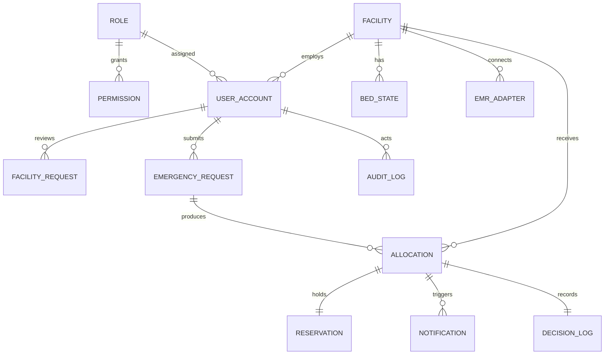

# 02 — Data Model

> Source of truth: thesis §3.6.3 (Figure 3.8). PostgreSQL 16 **with PostGIS**, SQLAlchemy 2.x async + GeoAlchemy2. Migrations via Alembic.

## 1. Entity-relationship overview

## 2. Security entities

### 2.1 `role`
| Field | Type | Notes |
|-------|------|-------|
| id | UUID PK | |
| name | enum(role) | four rows, seeded by migration |
| description | text | |

### 2.2 `permission`
| Field | Type | Notes |
|-------|------|-------|
| id | UUID PK | |
| role_id | UUID FK→role | |
| resource | text | e.g. `bed_state`, `facility`, `user_account`, `allocation`, `config` |
| action | enum(read, write, approve) | |
| scope | enum(own_facility, all) | `own_facility` enforces cross-facility isolation |

Seeded from the thesis role table (§3.6.5). **This is data, not code** — the RBAC middleware reads it, so a permission change is a migration, not a deploy.

### 2.3 `user_account`
| Field | Type | Notes |
|-------|------|-------|
| id | UUID PK | |
| email | citext unique | |
| password_hash | text | argon2id |
| role_id | UUID FK→role | exactly one role per account |
| facility_id | UUID FK→facility \| null | **null** for system_administrator and dispatcher |
| status | enum(active, suspended) | |
| created_by | UUID FK→user_account \| null | every account has a creator — no self-registration |
| created_at / last_login_at | timestamptz | |

**Invariant:** `role = facility_administrator` or `facility_staff` ⇒ `facility_id IS NOT NULL`. `role = dispatcher` or `system_administrator` ⇒ `facility_id IS NULL`. Asserted by a CHECK constraint.

### 2.4 `facility_request`
| Field | Type | Notes |
|-------|------|-------|
| id | UUID PK | |
| facility_name / ghs_code / tier | text / text / enum(tier) | |
| contact_email / contact_phone | text | |
| status | enum(pending, approved, rejected) | |
| reviewed_by | UUID FK→user_account \| null | system_administrator only |
| rejection_reason | text \| null | |
| created_at / reviewed_at | timestamptz | |

**Carries no privilege.** A pending request cannot authenticate. Approval creates the `facility` row plus its first `facility_administrator` account.

## 3. Domain entities

### 3.1 `facility`
| Field | Type | Notes |
|-------|------|-------|
| id | UUID PK | |
| name / ghs_code / region | text | |
| tier | enum(tier) | |
| location | `geography(Point,4326)` | **GIST index** |
| supported_bed_types | enum(bedtype)[] | derived from tier, stored for query speed |
| contact_phone | text | SMS recipient |
| active_data_source | UUID FK→emr_adapter \| null | null ⇒ manual maintenance |

### 3.2 `bed_state`
| Field | Type | Notes |
|-------|------|-------|
| facility_id | UUID FK→facility | PK part |
| bed_type | enum(bedtype) | PK part |
| capacity | int | total beds of this type |
| available | int | `0 ≤ available ≤ capacity`, CHECK constraint |
| **version** | bigint | **incremented on every write — drives compare-and-set** |
| updated_at | timestamptz | |
| updated_by | UUID FK→user_account \| null | null when written by an adapter |

**The `version` column is the concurrency mechanism.** Never update `available` without also incrementing `version` in the same statement.

### 3.3 `emr_adapter`
| Field | Type | Notes |
|-------|------|-------|
| id | UUID PK | |
| facility_id | UUID FK→facility | |
| adapter_type | enum(manual, ghs_data, fhir_r4, rest_polling) | |
| endpoint / auth_config | text / jsonb | credentials encrypted at rest |
| last_sync_at | timestamptz \| null | |
| status | enum(active, stale, failed) | drives the staleness warning |

### 3.4 `emergency_request`
| Field | Type | Notes |
|-------|------|-------|
| id | UUID PK | |
| dispatcher_id | UUID FK→user_account | |
| origin | `geography(Point,4326)` | |
| urgency | enum(urgency) \| null | null ⇒ fixed-weight fallback |
| required_bed_type | enum(bedtype) | |
| created_at | timestamptz | |

**No patient identifiers.** No name, no ID number, no diagnosis. Enforced by schema review (NFR7).

### 3.5 `allocation`
| Field | Type | Notes |
|-------|------|-------|
| id | UUID PK | |
| request_id | UUID FK→emergency_request | |
| facility_id | UUID FK→facility \| null | null on escalation |
| strategy_used | enum(strategy) | |
| weight_vector | jsonb | the (w_t, w_b, w_c) actually applied |
| score | numeric \| null | |
| travel_time_minutes | numeric \| null | |
| is_estimated_travel_time | bool | true if Haversine fallback used |
| eta_minutes | numeric \| null | drives reservation expiry |
| capability_match | numeric \| null | ĉ of the placement |
| candidates_evaluated | int | size of Hₑ |
| attempts | int | reservation attempts before success (FR9) |
| selection_reason | text | human-readable |
| status | enum(status) | pending / confirmed / arrived / expired / refused / escalated |

### 3.6 `reservation`
| Field | Type | Notes |
|-------|------|-------|
| id | UUID PK | |
| allocation_id | UUID FK→allocation unique | |
| facility_id / bed_type | UUID FK / enum | |
| expires_at | timestamptz | `created_at + eta_minutes + RESERVATION_GRACE_MIN` |
| acknowledged_at | timestamptz \| null | advisory; never blocks (FR20) |
| confirmed | bool | true when arrival recorded |
| released_at | timestamptz \| null | set by the expiry sweeper |

Separate entity, not a column on `allocation`, because it has **its own lifetime** and may expire independently of the allocation record.

### 3.7 `notification`
| Field | Type | Notes |
|-------|------|-------|
| id | UUID PK | |
| allocation_id | UUID FK→allocation | |
| channel | enum(sms, push) | |
| recipient | text | facility contact_phone |
| payload | jsonb | urgency, bed_type, eta, reference |
| sent_at | timestamptz \| null | |
| delivery_status | enum(pending, sent, failed) | |
| attempts | int | |

### 3.8 `decision_log`
| Field | Type | Notes |
|-------|------|-------|
| id | UUID PK | |
| allocation_id | UUID FK→allocation | |
| candidates | jsonb | every candidate with t̂, b̂, ĉ and score |
| weights | jsonb | vector applied |
| parameters_snapshot | jsonb | radii, capability matrix in effect |
| rejected_reason | text \| null | |

**Enables FR12 replay:** recomputing the score from `candidates` + `weights` must reproduce the recorded ranking exactly.

### 3.9 `audit_log`
| Field | Type | Notes |
|-------|------|-------|
| id | UUID PK | |
| user_id | UUID FK→user_account \| null | null for adapter-originated writes |
| action / entity / entity_id | text | |
| detail | jsonb | |
| logged_at | timestamptz | |

Every create, modify or approve (NFR8).

## 4. Indexes

- `facility USING GIST (location)` — **required by FR3**; absence is a defect
- `bed_state (facility_id, bed_type)` primary key
- `reservation (expires_at) WHERE released_at IS NULL` — partial index for the sweeper
- `allocation (status)`, `allocation (created_at)`
- `user_account (email)` unique, `user_account (facility_id)`
- `audit_log (logged_at)`, `audit_log (user_id)`

## 5. Invariants

1. `0 ≤ available ≤ capacity` on every write.
2. `version` increments on every `bed_state` mutation, in the same statement.
3. A reservation is created **only** after a successful compare-and-set.
4. `weight_vector` and `decision_log.candidates` persisted on every allocation — auditability is a thesis requirement (NFR4).
5. Escalated allocations have `facility_id = null` and `status = escalated`.
6. Facility-scoped accounts carry `facility_id`; unscoped roles do not (CHECK constraint).
7. No table stores patient-identifying data.

## 6. Migrations

- Alembic; one migration per schema change; **never edit a shipped migration**.
- Roles and permissions are seeded **by migration** (they are behaviour, not sample data).
- Facilities are loaded by an idempotent seed **script**, not a migration ([11 §5](./11-development-setup.md)).
- PostGIS extension enabled in the first migration: `CREATE EXTENSION IF NOT EXISTS postgis;`
