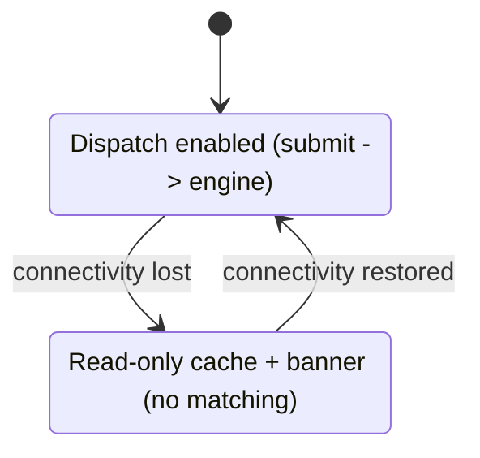

# 05 — Mobile Application

> Source of truth: thesis §3.9–3.10. Stack: React Native + Expo SDK 51, Expo SQLite (cache), Expo Background Fetch (sync), Expo Push Notifications, Google Maps SDK. The app is a **thin client**; it never runs matching logic.

## 1. Primary user
A National Ambulance Service (NAS) dispatcher making decisions under time pressure. UI optimised for speed and legibility, not feature breadth.

## 2. Screens (thesis §3.9)

### 2.1 Dispatch Screen (primary, online)
- Inputs: patient location (device GPS or map tap), urgency (critical/urgent/standard), required bed type (general/icu/maternity_specialist).
- Action: submit → `POST /api/v1/allocations`.
- Output: recommendation card — facility name, tier, available beds, travel time, map view; or an escalation card (nearest within radius + nearest available outside radius + "manual decision required").
- Shows whether travel time is estimated (`is_estimated_travel_time`).

### 2.2 Facility Map Screen
- All registered facilities as markers, colour-coded by bed availability.
- Loads from the **local cache**; works online and offline.

### 2.3 Simulation Screen
- Trigger Automatic Mode runs and view Interactive Mode step traces (calls `/simulation/...`).
- For demonstration and audit of decisions; not the dispatcher's daily surface.

### 2.4 Settings Screen
- Configure API base URL, sync interval (default 15 min), trigger manual sync, view last-sync status.

## 3. Offline informational mode (thesis §3.10) — strict boundary

When connectivity is lost the app enters offline mode:
- **No** algorithm runs, **no** request is submitted, **no** recommendation is generated.
- Prominent banner: "Matching requires connectivity" + last-sync timestamp.
- Read-only list of cached facilities: last-known bed counts, capability tier, contact numbers — enough to support informed manual telephone contact.



The cache stores **only** facility profiles + bed counts. There is no client-side matching code to keep in parity with the engine — this is the deliberate reason offline matching is excluded (thesis §3.10).

## 4. Local cache (Expo SQLite)
- Tables mirror the facility registry fields needed for display: id, name, lat, lon, tier, supported_bed_types, contact_phone, last-known bed counts, `synced_at`.
- Populated by `GET /api/v1/facilities` (full or `?updated_since=`).

## 5. Background sync (Expo Background Fetch)
- Periodic refresh of the cache at the configured interval (default 15 min) whenever connectivity is available.
- Manual sync available in Settings.
- Sync is best-effort; failures are surfaced as stale `synced_at`, never as silent success.

## 6. Notifications
- Recommendation delivered in-app and via Expo Push Notifications when online.
- SMS path (Africa's Talking) is **stubbed** server-side; the app does not implement SMS.

## 7. Suggested module layout
```
mobile/app/
  screens/   DispatchScreen.tsx  FacilityMapScreen.tsx  SimulationScreen.tsx  SettingsScreen.tsx
  components/
  services/  api.ts  cache.ts  sync.ts  connectivity.ts  notifications.ts
  state/     (request form, connectivity status, settings)
  navigation/
```

## 8. Client rules
- All matching decisions come from the engine response; the client renders, it does not compute.
- The client must clearly distinguish online recommendation vs offline informational view at all times.
- No business logic (scoring, filtering, ranking) in the client — that is a thesis-level boundary and a review-blocking violation if introduced.
