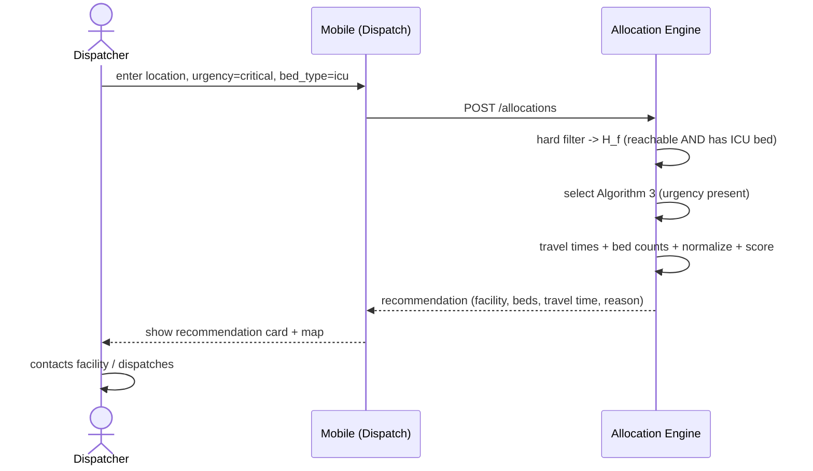
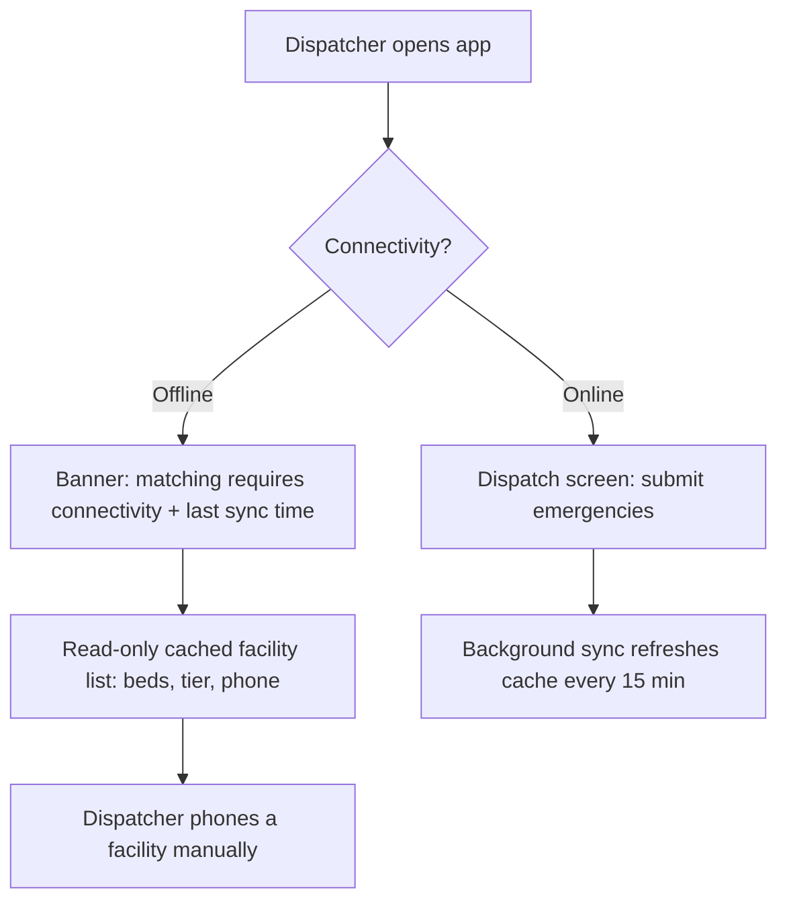
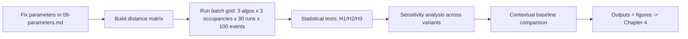
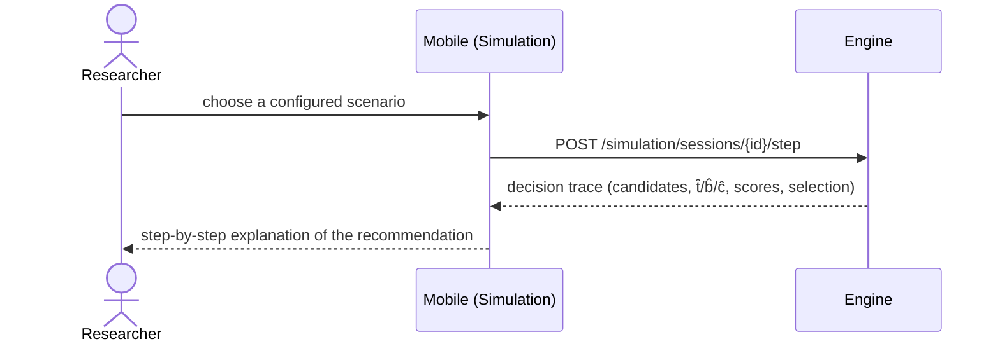

# 06 — User Flows & Journeys

> Source of truth: thesis §3.4, §3.6, §3.9–3.10, §3.12. Diagrams are normative for behaviour; numbers come from [09-parameters.md](./09-parameters.md).

## 1. Actors
- **Dispatcher** (primary) — submits emergencies, reads recommendations.
- **Facility administrator** `[IMPL]` — registers facilities and bed capacities.
- **Researcher** — runs simulations and the evaluation pipeline.

## 2. Journey A — Online emergency dispatch (happy path)



## 3. Journey B — Escalation (no reachable bed)

```mermaid
sequenceDiagram
  actor D as Dispatcher
  participant App as Mobile (Dispatch)
  participant Eng as Allocation Engine
  D->>App: enter location, urgency=critical, bed_type=icu
  App->>Eng: POST /allocations
  Eng->>Eng: hard filter -> H_f empty
  Eng-->>App: escalation (nearest within radius=0 beds; nearest available outside; manual decision required)
  App-->>D: show escalation card (two fallbacks + warning)
  D->>D: makes a manual judgement call
```

The engine never silently routes to an unreachable facility; the dispatcher is given the two most useful fallbacks and told a manual decision is required.

## 4. Journey C — Maps API unavailable (degraded, still works)

```mermaid
sequenceDiagram
  participant Eng as Allocation Engine
  participant Maps as Distance Matrix API
  Eng->>Maps: travel times
  Maps--xEng: timeout / error
  Eng->>Eng: Haversine fallback @ 30 km/h
  Eng-->>Eng: is_estimated_travel_time = true
  Note over Eng: still returns a recommendation; flag surfaced to dispatcher
```

## 5. Journey D — Offline informational mode



No matching occurs offline. The dispatcher still has last-known data to act on.

## 6. Journey E — Facility registration `[IMPL]`

```mermaid
sequenceDiagram
  actor A as Facility admin
  participant API as Engine API
  A->>API: POST /facilities {name, coords, tier, bed types, phone}
  API-->>A: 201 facility (id)
  A->>API: PATCH /facilities/{id}/beds {type, available, capacity}
  Note over API: facility now in candidate pool; mobile caches on next sync
```

## 7. Journey F — Researcher runs the evaluation



## 8. Journey G — Interactive single-event demonstration (thesis §3.12.2)



## 9. State transitions of an emergency request
```
pending --> allocated      (H_f non-empty, facility selected)
pending --> escalated      (H_f empty)
```
No other transitions. Every request ends in exactly one terminal state and is persisted with full audit fields.
