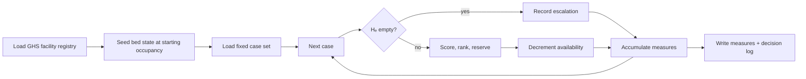

# 07 — Scenario Testing

> Source of truth: thesis §3.8. **This document replaces the previous `07-simulation.md`.** Discrete-event simulation with stochastic arrivals, a virtual clock, length-of-stay sampling and a 270-run grid is **no longer part of this project**. Do not build it.

## 1. Why scenario testing rather than simulation

Three options were available and the reasoning is recorded here so it is not relitigated in code review.

**Live comparative trial** — unavailable. Exposing emergency patients to an experimental allocation policy would be unethical, and network access for such a trial is beyond the project.

**Stochastic discrete-event simulation** — would permit conclusions across distributions of arrival and occupancy, but at the cost of a modelled arrival process whose fidelity to genuine emergency demand cannot be established. The strength of any conclusion would then rest on an assumption rather than on data.

**Scenario-based testing on real facility data** — chosen. The facility registry is real, the case set is fixed and inspectable, and every run is exactly reproducible **without a random seed**, because there is no randomness anywhere.

What is lost: generality across occupancy distributions. This is stated plainly in the thesis limitations, not obscured.

## 2. Principle

The scenario runner is a **real client of the engine**. It submits cases through the same allocation code path as live operation — same hard filter, same normalisation, same scoring, same reservation. Nothing about the evaluated system differs from the delivered system.



## 3. Determinism by construction

There is **no random seed in this project.** The case set is a version-controlled file; the facility registry is a version-controlled CSV; the starting bed state is a deterministic function of capacity and the configured occupancy; the tie-break is deterministic ([03 §9](./03-scoring-and-ranking.md)).

Two runs of the same case set under the same strategy and parameters must produce **byte-identical** measure output. This is asserted in test ([12 §5](./12-testing.md)), and it is a stronger reproducibility guarantee than seeded simulation offers.

## 4. The case set

`scenario/cases.json`, fixed and version-controlled. Each case:

```json
{ "case_id": "C001", "origin_lat": 5.6037, "origin_lon": -0.1870,
  "urgency": "critical", "required_bed_type": "icu" }
```

Constructed to span the conditions the system must handle ([09 §11](./09-parameters.md)):

- **Dense urban origins** (Circle, Osu, Madina, Adabraka) and **peripheral** (Kasoa fringe, Prampram, Amasaman)
- **All three urgency tiers**, in the configured proportion
- **Bed types with wide availability** (general) and **narrow** (ICU, specialist)
- **At least eight cases with no admissible candidate**, to exercise escalation deliberately rather than by accident

Cases are presented in **file order** to every strategy. Order is part of the fixture.

## 5. Depletion protocol

Bed state is seeded once at the configured starting occupancy:

```
available = round(capacity × (1 − occupancy))
```

Each successful allocation decrements availability and **it is not released during the run**. There is no length-of-stay model and no bed return. This is deliberate: decisions made earlier in the sequence constrain those available later, which is what makes the test a test of *allocation policy* rather than of independent lookups, and it reproduces in miniature the online, irrevocable character of the problem (thesis §2.4.2).

Each strategy starts from an **identical** seeded state.

## 6. Measures (thesis Table 3.10)

| Measure | Definition | Denominator |
|---------|------------|-------------|
| Travel time to placement | travel minutes to the allocated facility | allocated cases only |
| Escalation rate | proportion of cases with `Hₑ` empty | all cases |
| Facility attempts per case | reservation attempts before one succeeded | all cases |
| Capability match | mean ĉ of the allocated facility | allocated cases only |
| Critical cases at tertiary | proportion of critical cases allocated to a tertiary facility | critical cases only |
| Placement success | proportion of cases allocated a bed | all cases |

**Every measure is reported disaggregated by urgency tier.** An aggregate mean conceals precisely the differentiation the urgency-adaptive strategy is designed to produce.

## 7. Runner

```
backend/app/scenario/runner.py

for strategy in [nearest_facility, fixed_weight, urgency_adaptive]:
    reset_bed_state(occupancy)                 # identical starting state
    for case in load_cases("scenario/cases.json"):   # file order
        result = allocation_service.allocate(case, forced_strategy=strategy)
        record(result)
    write_measures(strategy)
```

Outputs under `artifacts/scenario/<study_id>/`:

- `measures.csv` — one row per strategy per urgency tier per measure
- `decisions.jsonl` — full decision trace per case (candidates, t̂/b̂/ĉ, scores, selection)
- `manifest.json` — parameter snapshot, case-set hash, facility-CSV hash, code commit

## 8. Robustness check

The complete case set is re-run under **one** alternative weight set ([09 §12](./09-parameters.md)) in which the contrast between urgency tiers is deliberately reduced.

Purpose is confined and must not be overstated: to establish whether any difference observed between the fixed-weight and urgency-adaptive strategies **survives a change in the degree of urgency conditioning**, or whether it is an artefact of one particular choice of weights.

This is **not** a sensitivity analysis. There is no parameter sweep, no grid over radii, and no capability-matrix variant. One alternative weight set, one re-run, one comparison table.

## 9. What must never enter a measure

- Wall-clock time or HTTP latency. Travel time is a **modelled clinical quantity**, not server performance.
- Any value not derivable from the case set, the facility registry and the parameters.
- Randomness of any kind.
