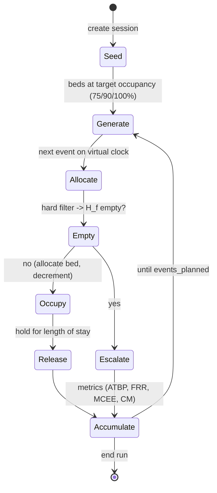

# 07 — Simulation

> Source of truth: thesis §3.12. Constants in [09-parameters.md](./09-parameters.md). The simulation is the project's evaluation instrument; it must be reproducible under a fixed seed.

## 1. Principle (thesis §3.12.1)

The simulation is a **real client of the engine**: it generates synthetic emergency events and submits them through the same allocation code path as live operation. Each run is isolated in a `SimulationSession`; all bed reads/writes go to `SimulationDataSource` over the session's `simulation_bed_state`. The live registry is never modified.



## 2. Virtual clock (thesis §3.12.1)

Timing measures **clinical placement time**, not server latency.

- Each event gets a `virtual_arrival_min`; inter-arrival times advance the clock (1 event per 3–7 min, uniform).
- For an **allocated** event:
  ```
  time_to_bed_placement_min = COORDINATION_OVERHEAD_MIN + travel_time_minutes(h*)
  ```
  This is the ATBP contribution. It is **not** the wall-clock latency of the HTTP call.
- An allocated patient occupies the bed for a sampled length of stay (`los_minutes`); at `virtual_arrival_min + los_minutes` the bed returns to the pool. Occupancy therefore fluctuates around the seeded level rather than only declining — keeping the scenario meaningful across all events.

`COORDINATION_OVERHEAD_MIN`, LOS distribution and means are `[IMPL]` defaults in [09-parameters.md §8.1](./09-parameters.md) — fix them before any evaluation run.

## 3. Precomputed distance matrix (thesis §3.12.1, revised)

To keep large runs feasible and reproducible, travel times during simulation are served from a **precomputed matrix** over the 24 facilities and a grid/sample of patient locations within the Greater Accra bounding box — reproducing the live Travel-time Service interface without a live API call per event.

- Build once per study: `backend/app/simulation/distance_matrix.py` produces `distance_matrix.parquet` (or `.npz`) keyed by (sampled_location_id, facility_id) → minutes.
- Patient locations are sampled from `GA_BBOX` under `RANDOM_SEED`; each event maps to the nearest grid node (or a directly sampled point with cached lookups).
- The matrix build may call the real maps API a bounded number of times (grid × facilities), or use Haversine at 30 km/h if no API key is configured — record which was used.

## 4. Occupancy scenarios

Seed `simulation_bed_state.available = round(capacity · (1 − occupancy))` per facility/bed-type, for occupancy ∈ {0.75, 0.90, 1.00}. At 100% occupancy initial availability is 0 (beds free up only via LOS release), which is the intended stress test.

## 5. Modes (thesis §3.12.2)

- **Automatic** (`/run`): generate and process `events_planned` events, accumulate metrics, persist per-event records. 30 runs per configuration per scenario (different seed per run, recorded).
- **Interactive** (`/step`): process one event, return the full decision trace (candidates, normalised values, scores, selection). Used to illustrate/audit individual decisions; not part of the statistical sample.

## 6. Event generation

Per event, under the session seed:
1. `virtual_arrival_min += uniform(3, 7)`.
2. `urgency ~ {critical 0.20, urgent 0.35, standard 0.45}`.
3. `required_bed_type ~ {general 0.40, icu 0.30, maternity_specialist 0.30}`.
4. `patient_location ~ PATIENT_LOCATION_SAMPLING`.
5. Submit through the allocation service; record the result + (if allocated) sample `los_minutes` and schedule bed release.

## 7. Batch runner

`backend/app/simulation/runner.py` orchestrates the full grid:

```
for algorithm in [greedy, weighted, urgency_adaptive]:
  for occupancy in [0.75, 0.90, 1.00]:
    for run in range(30):
      seed = base_seed + hash(algorithm, occupancy, run)   # deterministic, recorded
      session = create_session(algorithm, occupancy, events=100, seed)
      run_session(session)
    collect per-run metric means -> dataset for analysis
```

Pairing for statistics: the **same** seed sequence is used across algorithm configurations at a given occupancy/run index, so compared runs share facility state (enables paired tests — see [08-evaluation.md](./08-evaluation.md)).

## 8. Metrics computed per run (thesis §3.13.1)

| Metric | Definition |
|--------|------------|
| ATBP | mean `time_to_bed_placement_min` over **allocated** events (escalated excluded) |
| FRR | fraction of events with `status = escalated` (H_f empty) |
| MCEE | mean `candidates_evaluated` per event |
| CM | mean `capability_match` over allocated events; also reported for critical-only |

Per-run means are the unit of analysis (n = 30 per configuration per scenario).

## 9. Reproducibility rules
- Every session records its `random_seed`; re-running with the same seed reproduces identical per-event outcomes.
- The distance matrix file is content-hashed and the hash recorded with the results.
- No wall-clock time or network latency enters any metric.
- Outputs (per-run CSV/Parquet + per-event records) are written under `artifacts/sim/<study_id>/`.
