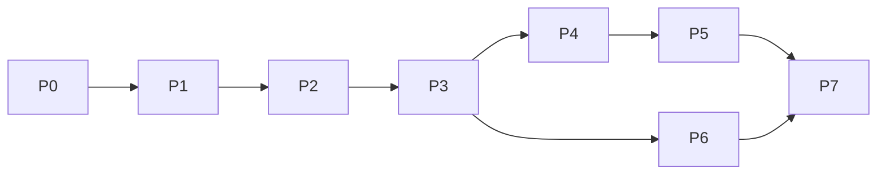

# 15 — Implementation Roadmap

> A phased build order. Each phase has explicit acceptance criteria and maps to the thesis objectives (PRD §3). Phases are sequential where dependencies require it; within a phase, tasks can be parallelised.

## Phase 0 — Foundations
**Goal:** repo, config, DB, CI skeleton.
- Monorepo layout ([10](./10-project-structure.md)); `parameters.py` mirroring [09](./09-parameters.md) with load-time validations ([09 §12](./09-parameters.md)).
- Docker Compose (engine + postgres 16); Alembic; health/readiness endpoints.
- CI: lint + unit test scaffold.

**Acceptance:** RB-1 passes; `parameters.py` rejects invalid configs (weights not summing to 1, etc.); CI green on an empty test suite.

## Phase 1 — Facility registry + data model (O2)
**Goal:** facilities exist and are queryable.
- Entities + migrations ([02](./02-data-model.md)).
- Facility Registry Service + `POST/GET/PUT /facilities`, `PATCH /facilities/{id}/beds`.
- Seed script + `data/ga_facilities.csv` (24 facilities).

**Acceptance:** RB-2 returns 24 facilities; integration tests for CRUD pass.

## Phase 2 — Bed data source abstraction (O2)
**Goal:** the Bridge layer.
- `BedDataSource` interface + `SimulationDataSource` (built); the other three as specified stubs with conformance tests ([01 §3.2](./01-architecture.md)).

**Acceptance:** interface conformance test passes; `SimulationDataSource` isolates session bed state ([12 §4](./12-testing.md)).

## Phase 3 — Allocation engine + algorithms (O3, core)
**Goal:** the heart of the system.
- Hard filter, normalization, capability lookup, travel-time service (Google + Haversine fallback).
- Algorithm 1/2/3 + selector ([03](./03-algorithms.md)).
- `POST /allocations` with full audit persistence + escalation shape ([04](./04-api-spec.md)).

**Acceptance:** **all deterministic vectors pass** ([12 §2](./12-testing.md)), including the `M(u)` regression guard; RB-3 returns valid allocations/escalations; maps-failure path returns `is_estimated_travel_time=true`.

## Phase 4 — Simulation engine (O3)
**Goal:** reproducible DES.
- Virtual clock, occupancy seeding, event generation, LOS bed release, metrics.
- Distance matrix build/lookup; `/simulation/...` endpoints; batch runner ([07](./07-simulation.md)).

**Acceptance:** RB-4, RB-5, RB-6 pass; reproducibility test (same seed → identical events) passes; a full 270-run grid completes and writes per-run metrics.

## Phase 5 — Evaluation pipeline (O3, O5)
**Goal:** turn simulation output into results.
- Statistics (t-test/Shapiro/Wilcoxon/Cohen's d), sensitivity, report + manifest ([08](./08-evaluation.md)).

**Acceptance:** RB-7, RB-8, RB-9, RB-10 pass; statistics verified against SciPy fixtures; a study reproduces identically from its manifest.

## Phase 6 — Mobile app (O4)
**Goal:** the dispatcher client.
- Dispatch, Facility Map, Simulation, Settings screens; cache + background sync; offline informational mode ([05](./05-mobile-app.md)).

**Acceptance:** online dispatch end-to-end against the engine; offline mode renders cache + banner and issues **no** `/allocations` call; no client-side matching logic (guard test).

## Phase 7 — Hardening & docs `[IMPL]`
**Goal:** prototype polish (bounded — production hardening is out of scope, PRD §5).
- API-key auth, request logging with correlation ids, error model completeness.
- Final pass: every doc section has corresponding code + tests; `study_manifest.json` captures full provenance.

**Acceptance:** anti-slop checklist clean repo-wide ([14 §5](./14-coding-standards.md)); coverage targets met ([12 §9](./12-testing.md)).

## Dependency graph

## Traceability (objective → phase)
| Objective | Phases |
|-----------|--------|
| O1 requirements | (this doc set) |
| O2 engine + abstraction | P1, P2, P3 |
| O3 algorithms + simulation + tests | P3, P4, P5 |
| O4 mobile app | P6 |
| O5 robustness + baseline | P5 |

## Build-completeness gate (maps to thesis Chapter 4)
The implementation is "thesis-complete" when: all algorithms pass vectors; the 270-run grid + sensitivity variants run reproducibly; H1/H2/H3 tests output statistic/df/p/Cohen's d; the contextual baseline comparison is produced; and the mobile app does online dispatch + offline informational mode. Producing the *numbers* is Chapter 4; this gate is producing the *instrument that yields them*.
