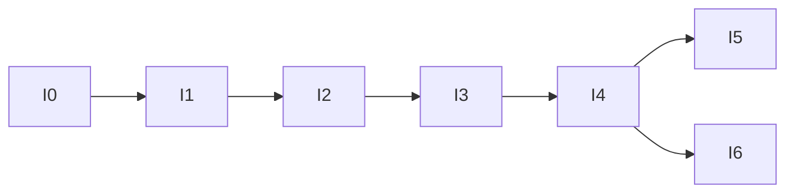

# 15 — Implementation Roadmap

> Five increments matching thesis §3.2 (incremental model). **Do not start an increment before the previous one's acceptance criteria pass.** Requirement IDs are the thesis IDs.

## Methodology note

The project follows the **incremental model** — one methodology, not "incremental and iterative". Each increment delivers a working capability on which the next depends and is verified in isolation before that dependency is taken on. Requirements are established once in advance ([PRD §3](./PRD.md)); they do not emerge through iteration. Parameter calibration is confined to Increment 5 and is experimental calibration, not methodological revision.

## I0 — Foundations (2 days)

- Monorepo layout ([10](./10-project-structure.md)); `parameters.py` mirroring [09](./09-parameters.md) with load-time validation.
- Docker Compose: engine + postgres:16 **with PostGIS**; Alembic; `/healthz`, `/readyz`.
- CI: lint + type-check + empty test suite green.

**Accept:** RB-1 passes; `parameters.py` rejects invalid configs (weights not summing to 1.0, radii out of order); PostGIS extension present.

## I1 — Registry, authentication, access control (6 days) — O1

- Entities + migrations ([02](./02-data-model.md)); roles and permissions seeded **by migration**.
- Auth: argon2id, JWT access + refresh, session handling.
- RBAC middleware — **single enforcement point**, scope resolution against `facility_id`.
- Facility registration request → approval → facility + first Facility Administrator.
- System Administrator provisions dispatchers directly.
- Audit log on every create/modify/approve.
- Facility registry CRUD; seed script + `data/ga_facilities.csv`.

**Accept:** FR1, FR15–FR18, NFR8. RB-2 loads the facility set. Role × endpoint matrix test passes in full. A pending registration cannot authenticate. Facility A's admin gets 403 on Facility B's data, read **and** write. A dispatcher gets 403 on every bed-write endpoint.

## I2 — Adapter interface and bed state (5 days) — O1, O4

- `BedDataSource` protocol; `ManualAdapter` and `GHSDataAdapter` both implemented.
- Bed state with `version` column; every write increments version in the same statement.
- Facility administration portal: registration, adapter configuration, manual bed maintenance, user management.

**Accept:** FR2, FR21, NFR9, S8. Interface conformance test passes for both adapters. A third stub adapter registers with zero changes under `domain/allocation/` — prove it with `git diff`.

## I3 — Retrieval, filtering, scoring and ranking (6 days) — O2 · **the contribution**

- PostGIS spatial retrieval with GIST index.
- Hard filter, normalisation, capability lookup.
- Travel-time service (Distance Matrix + Haversine fallback, flagged).
- Three strategies + strategy selector ([03](./03-scoring-and-ranking.md)).
- `POST /allocations` with full decision-log persistence and escalation shape.

**Accept:** FR3–FR7, FR11–FR13, NFR2. **All deterministic vectors pass** ([12 §2](./12-testing.md)), including the scalar-`M(u)` regression guard. Query plan shows index usage, not a sequential scan. RB-3 returns valid recommendations and escalations. Maps failure yields `is_estimated_travel_time=true`, not an error.

> **Write `domain/allocation/scoring.py` and its vectors first, before any HTTP or SQL in this increment.** It is pure, it runs in milliseconds with nothing else up, and it is what the supervisor will read.

## I4 — Reservation, ETA, notification, expiry (6 days) — O1, O4 · **highest risk**

- Compare-and-set reservation; `VersionConflict` → next candidate from the existing ranking, no re-query.
- ETA computation; reservation `expires_at = now + eta + grace`.
- Expiry sweeper as a separate process.
- SMS gateway interface + provider adapter + `LogGateway`.
- Arrival confirmation, advisory acknowledgement, refusal recording.

**Accept:** FR8–FR10, FR19, FR20, FR22, S1, S5. 500 concurrent claims on one bed → exactly one success, 20 repetitions, zero violations. Forced version conflict falls through to candidate #2 with no repeat spatial query (assert query count). Sweeper releases an expired reservation within one cycle.

> **Write the concurrency test before the reservation manager, not after.**

## I5 — Scenario runner and evaluation (5 days) — O3

- Case set `scenario/cases.json`; depletion protocol; runner ([07](./07-scenario-testing.md)).
- Measures, comparison, robustness check, figures, manifest ([08](./08-evaluation.md)).

**Accept:** FR23, S7. RB-4 through RB-7 pass. Two runs of the same case set under the same strategy produce byte-identical `measures.csv`. Comparison table and robustness verdict produced.

## I6 — Dispatcher mobile app (5 days) — O4

- Login, Dispatch, Facility Map, Settings screens; cache + background sync; offline informational mode ([05](./05-mobile-app.md)).

**Accept:** FR14. Online dispatch end-to-end. Offline mode renders cache + banner and issues **no** `/allocations` call. Guard test proves no scoring logic exists client-side.

## Dependency graph

## Cut order if time runs short

1. **Mobile app (I6)** → a single-screen client, or demonstrate through the portal
2. **Real SMS provider** → `LogGateway`, documented as a simulated gateway
3. **Portal polish** → function over appearance

**Never cut:** `domain/allocation/scoring.py` and its vectors; the concurrency test; the scenario runner. Those three are the thesis.

## Traceability

| Objective | Increments |
|-----------|------------|
| O1 — engine, adapter, RBAC, reservation | I1, I2, I4 |
| O2 — three strategies, complexity | I3 |
| O3 — scenario evaluation | I5 |
| O4 — mobile app, portal, SMS | I2, I4, I6 |

## Chapter Four, written alongside

| After | Draft |
|-------|-------|
| I0–I1 | Tools and technologies; schema as built; authentication and access control |
| I2 | Adapter interface; interoperability |
| I3 | Scoring and ranking implementation; worked example; complexity in practice |
| I4 | Reservation protocol; concurrency evidence; notification |
| I5 | Results, measures, figures, robustness, discussion against E1–E3 |

Only the results section requires the finished system. Chapter Five follows from Chapter Four and is written last.
